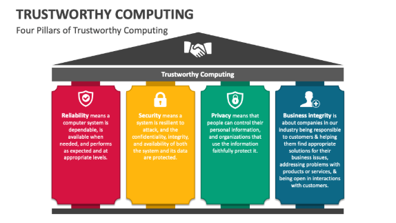

---
## Front matter
lang: ru-RU
title: Операционные системы
subtitle: Trustworthy Computing Initiative
author:
  - Бражко Александра Александровна
institute:
  - Руководитель Кулябов Дмитрий Сергеевич, д.ф.-м.н., профессор кафедры теории вероятностей и кибербезопасности
  - Российский университет дружбы народов, Москва, Россия
date: 14 апреля 2025

## i18n babel
babel-lang: russian
babel-otherlangs: english

## Formatting pdf
toc: false
toc-title: Содержание
slide_level: 2
aspectratio: 169
section-titles: true
theme: metropolis
header-includes:
 - \metroset{progressbar=frametitle,sectionpage=progressbar,numbering=fraction}
---

# Информация

## Докладчик

:::::::::::::: {.columns align=center}
::: {.column width="70%"}

  * Бражко Александра Александровна
  * студент 1 курса факультета ФМЕН
  * Российский университет дружбы народов
  * [1132246807@pfur.ru](mailto:1132246807@pfur.ru)

:::
::: {.column width="30%"}

:::
::::::::::::::

# Введение

## Введение

В начале 2000-х годов компания Microsoft столкнулась с серьёзными проблемами в области безопасности, приватности и надежности своих продуктов.
В 2002 Билл Гейтс объявил о запуске Trustworthy Computing Initiative.

# Цель доклада

## Цель доклада

Целью данного доклада является анализ Trustworthy Computing Initiative, ее основных принципов, реализованных стратегий, результатов и влияния на индустрию информационных технологий.

# Основная часть

## Основные принципы TWC

{ #fig:001 width=70% }

## Реализованные стратегии

- Переобучение разработчиков
- Аудит кода и обнаружение уязвимостей
- Сотрудничество с сообществом
- Интеграция безопасности в продукты
- Улучшение процесса выпуска обновлений
- Создание специализированных команд

## Достигнутые результаты

- Снижение числа уязвимостей
- Повышение качества кода
- Улучшение безопасности Windows
- Повышение доверия пользователей
- Создание безопасной экосистемы

## Влияние на индустрию информационных технологий

{ #fig:002 width=70% }

# Заключение

## Заключение

Trustworthy Computing Initiative была важным шагом в развитии компании Microsoft, а так же в развитии всей индустрии информационных технологий. Она помогла улучшить надежность, безопасность и конфиденциальность продуктов компании. Инициатива оказала влияние на развитие практик безопасности по всему виду.
